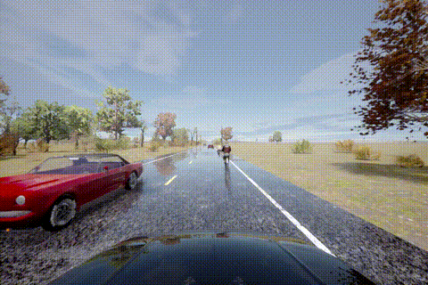
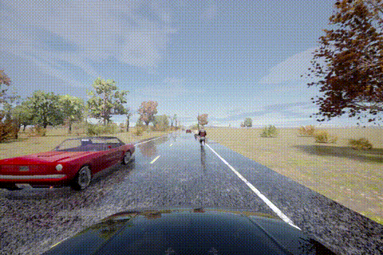
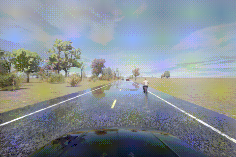

# SceneFlow

This repository contains the paper and the code of "Scene Flow Specifications: Encoding and Monitoring Rich Temporal Safety Properties of Autonomous Systems". The code is written in Python and requires [conda](https://docs.anaconda.com/free/anaconda/install/linux/) and [7z](https://www.7-zip.org/download.html) to be installed. The code was tested using Ubuntu 20.04.


## Example violations
Below are three example violations from the `HazardAtSideLaneTwoWays` scenarios

### Property 6: The opposing lane must be clear when passing vehicles


### Property 5: Passing a bike too closely
While the three-foot distance cited in the driving code is observed here, it is only barely met.
These violations were identified by increasing the required safety buffer.

Bike 1:


Bike 2:


## Installation
To install everything needed to run the code, execute the following command:
```bash
./unpack_data.sh
```
The installation script will do the following:
1) Unpack the included study data from `study_data.7z`
2) Create the conda environments as needed.
3) Install [mona](https://www.brics.dk/mona/) using the `install_mona.sh` script

## Usage
To reproduce the results of the paper, execute the following command:
```bash
./run.sh
```
This script will do the following:
1) Activate the conda environments as needed.
2) Unpack the scene graphs used in the experiment for RQ2 and RQ3.
3) Check the properties specified in the paper, located in the `symbolic_properties.py` file, using the scene graphs and the monitor instantiation. The violations will appear in `./results/`
4) Generate tables that show the property violations for each RQ.
